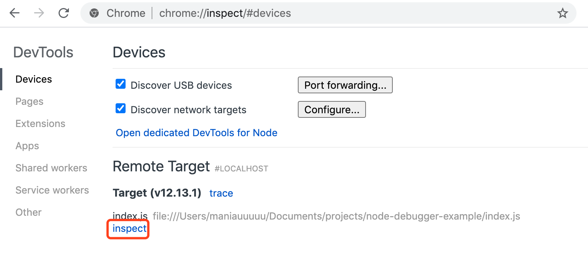
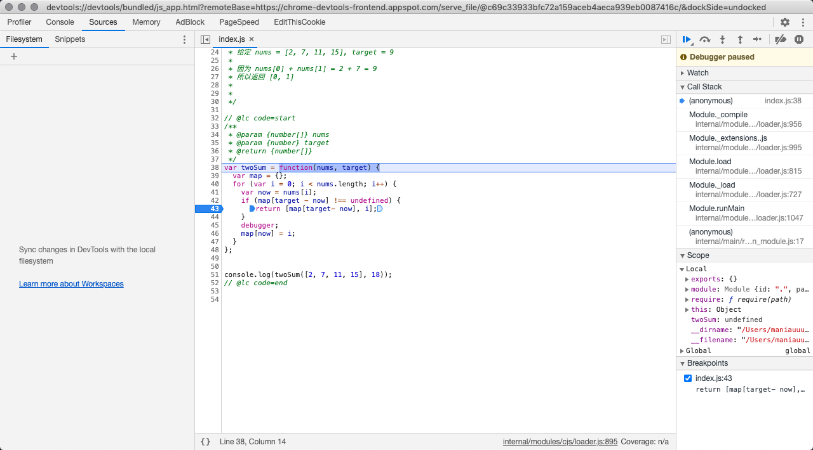
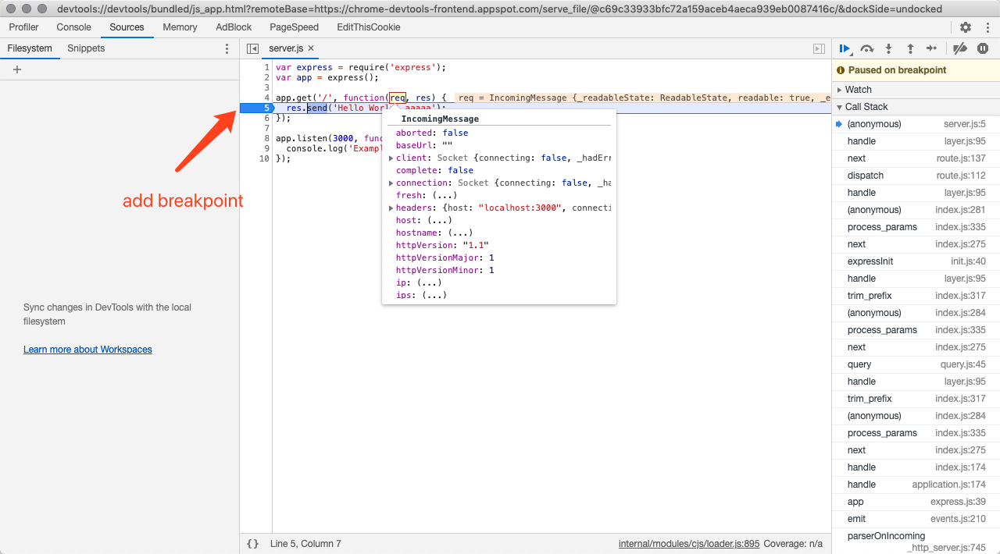
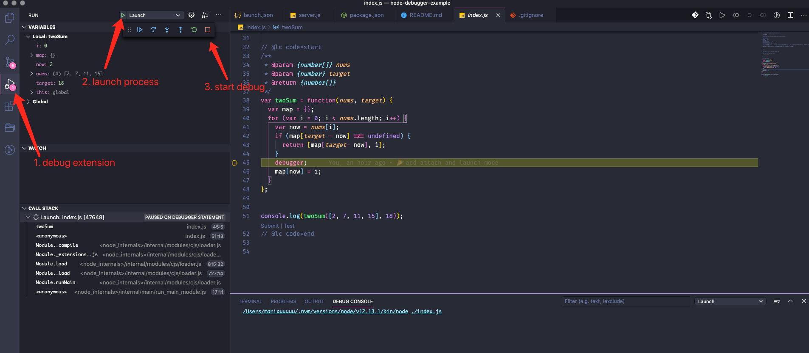
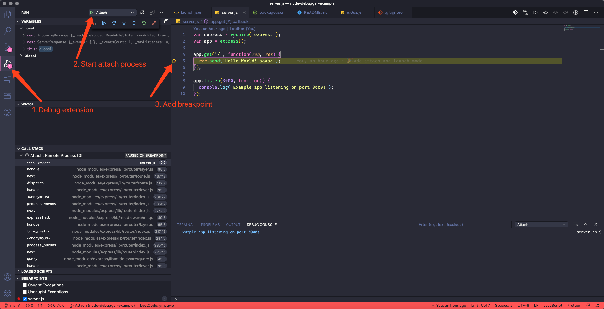

# debug mode

## What is Launch / Attach

### Launch

VSCode will start a new process to debug Node.js

### Attach

1. Run Node.js manually, use websocket to listen to debug info
2. Start a process attach to websocket port


## Chrome debug

### Launch

1. `node --inspect-brk index.js`
2. Open Chrome, go to `chrome://inspect`



3. Start debugging!



### Attach

1. `node --inspect-brk server.js`
2. Open Chrome, go to `chrome://inspect`
3. Let go of first breakpoint
4. Add breakpoint
5. Visit `localhost:3000`, start debugging



## VSCode debug

### Add configuration file

Create `.vscode/launch.json`

```json
{
  "version": "0.2.0",
  "configurations": [
      {
          "type": "node",
          "request": "launch",
          "name": "Launch",
          "program": "${workspaceRoot}/index.js"
      },   
      {
          "type": "node",
          "request": "attach",
          "name": "Attach",
          "port": 9229
      },
      {
        "name": "Attach to nodemon",
        "type": "node",
        "request": "attach",
        "restart": true,
        "port": 9229
      }
  ]
}
```

### Launch

1. Go to Run Extension
2. Launch Node.js
3. Start debugging



### Attach

1. `node --inspect-brk server.js`
2. Go to Run Extension, start attach process
3. Let go of first breakpoint
4. Add breakpoint
5. Visit `localhost:3000`, start debugging



### Nodemon
1. `nodemon --inspect-brk server.js`
2. Almost the same as above, apart from starting the `Attach to nodemon`


## Happy Debugging!